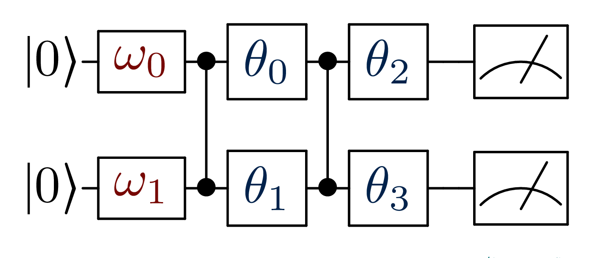

.. include:: ../substs.rst

A binary classifier
===================

In this tutorial we train and test a binary-quantum-classifier.

Dataset generation
------------------

We generate a dataset and its labels using :mod:`numpy` and we randomly split
it in a train and test with :func:`~sklearn.model_selection.train_test_split`
from :mod:`sklearn`.

::

   import numpy as np
   np.random.seed(42)

   n_pc = 100  # Points per component

   # Create a matrix on the point and its symmetry
   px, py = 0.75, 0.75
   X = np.asarray(n_pc * [[px, py]] +
                  n_pc * [[-px, -py]]
   )
   # Add gaussian noise
   X += 0.7 *  np.random.randn(*X.shape)
   # Create target vecor
   y = np.concatenate((np.zeros(n_pc), np.ones(n_pc)))

   # Split in train and test
   from sklearn.model_selection import train_test_split

   input_train, input_test, target_train, target_test =\
      train_test_split(X, y, test_size=.3)

Circuit definition
------------------

Now, we need to define the structure of the circuit, we do this using a
|make_c| function.
This function can have any name, but must take exactly three arguments, in the
following order: ``(bdr, x, params)``.
These correspond to a |circuitBuilder|, to an input vector, and to a
parameter vector.

::

   def simple_circuit(bdr, x, params):
      bdr.allin(x).cz(0,1).allin(params[:2])
      bdr.cz(0,1).allin(params[2:4])
      return bdr

This corresponds to the circuit in the following figure, where we use `input`
gates and `CZ entanglements`.
The precise syntax of |make_c| and the meaning of the `gates` are explained in the ":ref:`sec-circuit`" tutorial .

Now, we need to translate our description in a runnable circuit.
This is obtained using a |circuitML| class, which interacts with a backend;
in this case we use :ref:`sec-manyq`.

::

   from polyadicqml.manyq import mqCircuitML

   qc = mqCircuitML(make_circuit=simple_circuit,
                  nbqbits=2, nbparams=4)

Model training 
---------------

At this point, we are ready to create and train our first quantum |Classifier|.
We only need to choose which bitsrings will be used to predict the classes.

::
   from polyadicqml import Classifier 

   # Choose two bitstrings
   bitstr = ["01", "10"]

   model = Classifier(qc, bitstr).fit(input_train, target_train)

Predict on new data
-------------------

Once the model is trained, we can easily predict the class of any new sample.

::

   pred_train = model(input_train)
   pred_test = model(input_test)

And we can assert the performance of the model by confronting the predictions
and the true labels.

::

    >>> from polyadicqml.utility import print_results

    >>> print_results(target_train, pred_train, name="train")

   ##########################
   Confusion matrix on train:
   [[66  3]
    [ 4 67]]
   Accuracy : 0.95

    >>> print_results(target_test, pred_test, name="test")

   ##########################
   Confusion matrix on test:
   [[30  1]
    [ 2 27]]
   Accuracy : 0.95

Source code
-----------

This example script can be found in the `GitHub example page`_ as
``quickstart.py``.
