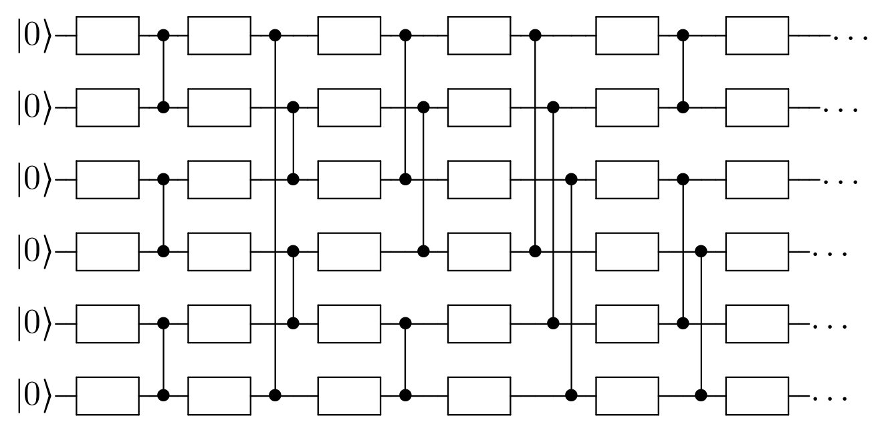
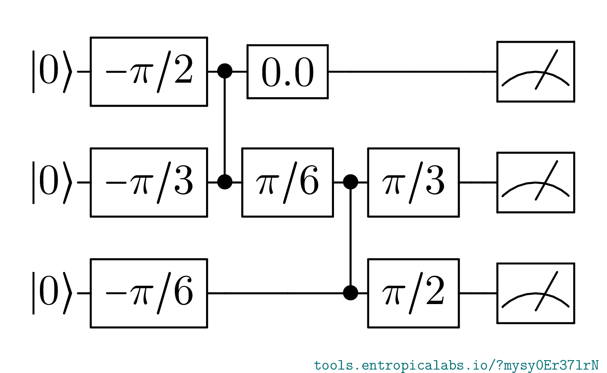
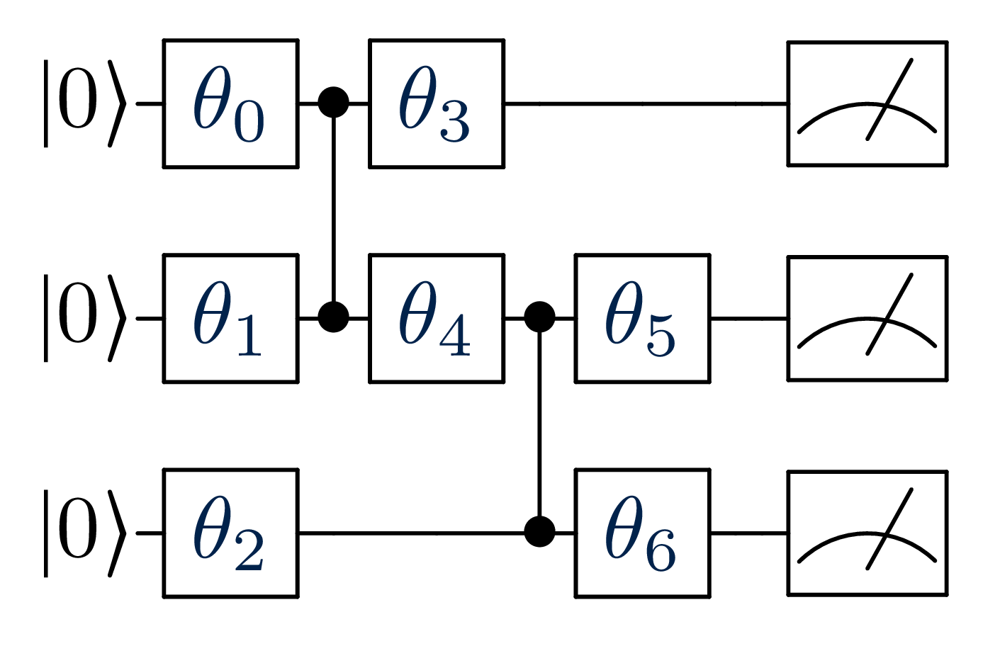
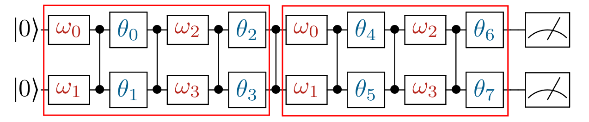
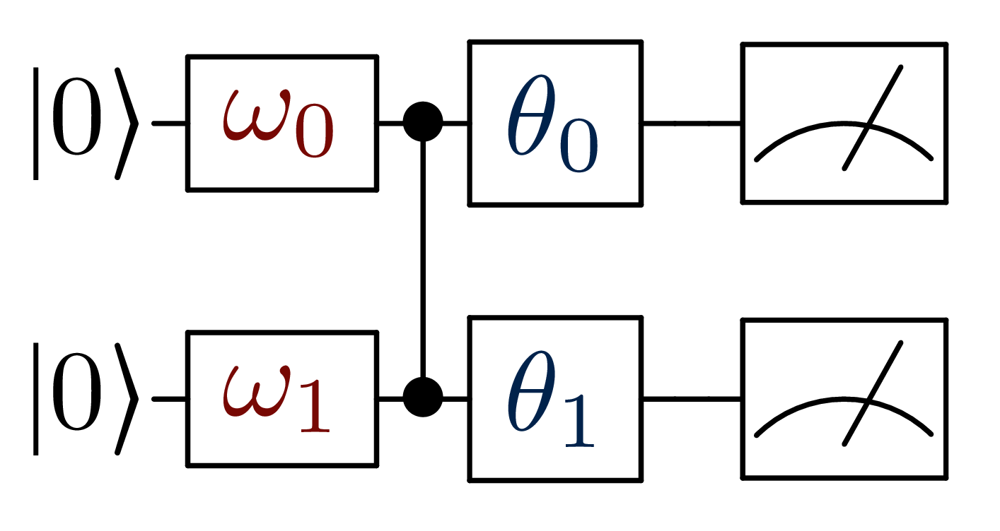
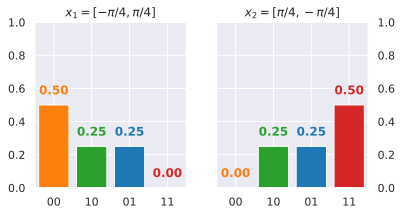
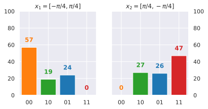

.. include:: ../substs.rst

.. _sec-circuit:

Defining a quantum circuit
==========================

The first step in running a Quantum Machine Learning algorithm consists
in defining a *parametric quantum circuit*.
A quantum circuit is a sequence of instructions, or *gates*, that we
apply to one or more *qubits*, the computational units of a quantum computer.
A circuit being parametric means that the gates depend on some parameters,
which in our case will be real valued angles.

   Example of a quantum circuit.

The figure gives a graphical representation of a quantum circuit.
Each line represents a qubit, to which gates are applied from the left to right.
We use rectangles to identify *single-qubit gates* and vertical lines,
terminating with a specific marker, to represent *entangling gates*,
which affect two qubits.
The leftmost symbol of each line gives the initial state of the
corresponding qubit, which we always assume to be :math:`|0\rangle`.

The |circuitBuilder| class
++++++++++++++++++++++++++++++++++++++++++++++

Since different quantum computer providers use different functions to
implement the same operations, we resort to a circuit builder, which
abstracts away the provider's syntax.

The |circuitBuilder| class defines some high level methods to address
qubit operations:

* :meth:`~polyadicqml.circuitBuilder.input`\ (``idx``, ``theta``): Add
  *input* gate to the qubit corresponding to
  index ``idx``.
  This consists of a qubit rotation of :math:`RX(\pi/2) RZ(theta) RX(\pi/2)`.
  Both ``idx`` and ``theta`` can be iterables; in this case, for each 
  element of ``theta``, a single input gate is added to the corresponding
  index in ``idx``.

  .. figure:: ../figures/gate-input.png
     :scale: 15%
     :alt: Input gate
     :align: center
      
     Input gate representation.

* :meth:`~polyadicqml.circuitBuilder.allin`\ (``theta``): This operation
  takes a list of angles and, for each 
  element, add an input gate to the corresponding qubit.
  It has the same effect as :code:`input(range(nbqbits), theta)`.

* :meth:`~polyadicqml.circuitBuilder.cz`\ (``a``\ , ``b``): Add CZ gate
  between qubits ``a`` and ``b``. This is a symmetric entangling gate.
  
  .. figure:: ../figures/gate-cz.png
     :scale: 10%
     :alt: CZ gate
     :align: center
      
     CZ gate representation.
  
* :meth:`~polyadicqml.circuitBuilder.measure_all`\ (): Add measurement to all qubits.

  .. figure:: ../figures/gate-meter.png
     :scale: 10%
     :alt: Measurement gate
     :align: center
      
     Measurement gate representation.

* :meth:`~polyadicqml.circuitBuilder.circuit`\ (): This method returns
  the circuit completed with the provided instructions.
  The specific return type varies across the builder implementations,
  but, as we will see when discussing the |make_c| function and the
  |circuitML| class, we never manipulate circuits directly.
     
Example
-------

We can now build our first quantum circuit.
As |circuitBuilder| is an abstract class, we use for this example the
Qiskit implementation, but note that any builder would produce the same
circuit.
The Qiskit implementation is presented in depth in :ref:`sec-qiskit`.

We use a vector :math:`\theta`  of size seven to define the three-qubits 
circuit in figure.

::

    from polyadicqml.qiskit import qkBuilder
    import numpy as np

    # We create the vector [-pi/2, -pi/3, -pi/6, 0, pi/6, pi/3, pi/2]
    theta = np.linspace(-np.pi/2, np.pi/2, 7)

    # We instantiate the builder

    bdr = qkBuilder(3)  # 3 is the number of qubits

    # We start by inputting the first three elements of theta

    bdr.allin(theta[:3])

    # Then we entangle the first two qubits

    bdr.cz(0,1)

    # Then input el. 3 and 4 from theta in qubits 0 and 1

    bdr.input([0,1], theta[[3,4]])

    # Then again entanglement and input
    # Note that we can concatenate instructions

    bdr.cz(1,2).input([1,2], theta[[5,6]])

    # Finally, we measure.
    bdr.measure_all()

Now that the builder is complete, we can retrieve the built circuit 
with ``bdr.circuit()``.
Furthermore, since we are using the Qiskit implementation, the return
type is a :class:`qiskit.circuit.QuantumCircuit`.
We can print it and verify that it corresponds indeed to our desired
circuit::

    >>> print(bdr.circuit())
            ┌──────────┐┌───────────┐┌──────────┐   ┌──────────┐ ┌───────┐  ┌──────────┐                                        ░ ┌─┐
      qr_0: ┤ RX(pi/2) ├┤ RZ(-pi/2) ├┤ RX(pi/2) ├─■─┤ RX(pi/2) ├─┤ RZ(0) ├──┤ RX(pi/2) ├────────────────────────────────────────░─┤M├──────
            ├──────────┤├───────────┤├──────────┤ │ ├──────────┤┌┴───────┴─┐├──────────┤   ┌──────────┐┌──────────┐┌──────────┐ ░ └╥┘┌─┐
      qr_1: ┤ RX(pi/2) ├┤ RZ(-pi/3) ├┤ RX(pi/2) ├─■─┤ RX(pi/2) ├┤ RZ(pi/6) ├┤ RX(pi/2) ├─■─┤ RX(pi/2) ├┤ RZ(pi/3) ├┤ RX(pi/2) ├─░──╫─┤M├───
            ├──────────┤├───────────┤├──────────┤   └──────────┘└──────────┘└──────────┘ │ ├──────────┤├──────────┤├──────────┤ ░  ║ └╥┘┌─┐
      qr_2: ┤ RX(pi/2) ├┤ RZ(-pi/6) ├┤ RX(pi/2) ├────────────────────────────────────────■─┤ RX(pi/2) ├┤ RZ(pi/2) ├┤ RX(pi/2) ├─░──╫──╫─┤M├
            └──────────┘└───────────┘└──────────┘                                          └──────────┘└──────────┘└──────────┘ ░  ║  ║ └╥┘
    meas_0: ═══════════════════════════════════════════════════════════════════════════════════════════════════════════════════════╩══╬══╬═
                                                                                                                                      ║  ║
    meas_1: ══════════════════════════════════════════════════════════════════════════════════════════════════════════════════════════╩══╬═
                                                                                                                                         ║
    meas_2: ═════════════════════════════════════════════════════════════════════════════════════════════════════════════════════════════╩═

The |make_c| function
++++++++++++++++++++++++++++++++++++++++++++++++++++++++

We just learned how to use a |circuitBuilder| to build a circuit.
Nonetheless, in machine learning, we are interested in running the same
circuit architecture with many different inputs and many different
parameters.
It is obvious that writing a new builder for each change in numerical
values would be a tedious and useless task.
Although, if we recall our previous circuit example, we notice how with
can easily substitute the vector ``theta`` with a variable, as in the
builder methods we only refer to it through its indices.

This idea motivates the introduction of the |make_c| function,
whose documentation we report here:

.. automethod:: polyadicqml.circuitML.make_circuit
    :noindex:

As we see, this function makes an explicit distinction between *input* and
*model* parameters, respectively ``x`` and ``params``.
Furthermore, the function signature has to respect the precised one,
by taking a builder, alongside the input and parameters vectors, and
returning an instructed builder.

Therefore, the implementation of a |make_c| function proceed as
follows, where we see highlighted the important parts.

.. code-block:: 
    :emphasize-lines: 1,8,9

    def make_circuit(bdr, x, params):

        ... # Series of instruction for the builder, e.g:
        bdr.input([0,1], x[[0,1]]).cz(0,1)
        bdr.input([0,1], params[[0,1]])
        ...

        # Return the instructed builder
        return bdr

This function is the only place in which we talk to quantum circuits -- even
if indirectly.
In fact, we give this function to a |circuitML|, which will handle the
backend, without having to worry about the shape of the internal
representation.

.. note::

    We usually avoid adding *measure* gates -- ``measure_all()`` -- in
    the |make_c| function, as we do not know in advance if we are
    working with the actual circuit output (i.e. the *measurement*) or
    with the simulated *quantum state*.

    In fact, measurement would collapse the quantum state, so its
    amplitudes, which we are interested in, would not be the bitstring
    probabilities anymore, but a mere sample.

    Again, this is handled by the |circuitML| class, explained next.

Example 1
---------

As first example, we just translate the |circuitBuilder| example, so that
:math:`\mathbf{\theta}` will now be any possible parameter vector
``params``, as shown in the figure.

::

    def make_circuit(bdr, x, params):

        # We pipeline some of the previous instructions
        # Note that `theta` has become `params`
        bdr.allin(params[:3])
        bdr.cz(0,1).input([0,1], params[[3,4]])
        bdr.cz(1,2).input([1,2], params[[5,6]])

Note that this circuit is independent from the input vector ``x``, as it
is not used, but it is still required in the function signature.
We can obtain the same circuit as in previous example by calling

::

    make_circuit(qkBuilder(3), [], theta).measure_all().circuit()

Example 2
---------

For the second example, we define a circuit on two qubits, for
four-dimensional data.
The circuit has eight parameters and its structure is repetitive, which we
can leverage with the functional nature of |make_c| and the builder.
The figure represents the desired circuit, where :math:`\mathbf{\omega}`
represents the input vector ``x``; the red rectangles highlight the
repeated block.

::

    # We define a block function, as the structure is repetitive
    def block(bdr, x, p):
        bdr.allin(x[[0,1]])
        bdr.cz(0,1).allin(p[[0,1]])

        bdr.cz(0,1).allin(x[[2,3]])
        bdr.cz(0,1).allin(p[[2,3]])

    def make_circuit(bdr, x, params):
        # The fist block uses all `x`, but
        # only the first 4 elements of `params`
        block(bdr, x, params[:4])

        # Add one entanglement not to have two adjacent input
        bdr.cz(0,1)
        
        # The block repeats with the other parameters
        block(bdr, x, params[4:])

        return bdr

The |circuitML| class
+++++++++++++++++++++++++++++++++++++++++

The |circuitML| class provides the interface to run multiple parametric
circuits with different inputs and model parameters.  
We report its documentation:

.. autoclass:: polyadicqml.circuitML
    :noindex:
    :members:

This is an abstract class, so we cannot directly instaciate it, but it
fixes the interface.
As we see, the constructor requires four arguments: |make_c|,
``nbqbits``, ``nbparams``, and :class:`cbuilder`.
The first argument, |make_c|, corresponds to the function from
previous section, which |circuitML| will access as if it was an internal
method; thus the documentation provides the signature.
The latter, :class:`cbuilder`, is the class (*and not an instance*) of the
circuit builder to be used; as each child class knows its own backend
implementation, this argument is provided by default.

The main method of this class is |run|, which takes as input a design
matrix ``X`` and a parameter vector ``params`` and runs each
corresponding circuit.

People in quantum computing know that, given a circuit, we transform a
quantum state into another.
Nonetheless, the final quantum state is not accessible in an actual
quantum computer; we measure each qubit, which reads either ``0`` or
``1``.
The output of each mesurement is thus a binary sequence of length
``nbqbits``, a *bitstring*, which follows a probability distribution
given by the quantum state.
For each *run*, the quantum computer executes the circuit many times,
in what we call *shots*.
The run output is thus a sequence of ``nbshots`` bitstrings, which
gives a statistic of the underlying distribution.

Therefore, the output of a |run| call will be an array.
Each row corresponds to the run of the circuit given by the input sample.
Each row entry -- i.e. each column -- gives the number of times the
corresponding bitstring appeared in the shots, i.e. its *counts*.

That said, with enough computing power, it is possible to simulate
quantum computers with a small number of qubits and retrieve the actual
bitstring distribution.
In that case, we can exactly compute the bitstring distribution.
When possible, this corresponds to calling |run| with ``nbshots=None``,
which is also the default value.

Example
-------

We define a simple circuit, then, we run it for two different input points.
The 2-qubit circuit in figure takes a bidimensional input and two
parameters, which will be fixed.

We use the *manyq* implementation, which relies on a simulator and is
explained in detail in :ref:`sec-manyq`.
We need to define the |make_c| and then we can instantiate the
|circuitML|.

::

    # `make_circuit` can have any name
    def simple_circuit(bdr, x, params):
        return bdr.allin(x).cz(0,1).allin(params)

    # We instantiate the circuitML
    from polyadicqml.manyq import mqCircuitML

    circuit = mqCircuitML(simple_circuit, nbqbits=2, nbparams=2)

Now that we have a circuit, we can run it.
As we are using a simulator, we have acces to the probability
distribution, from which we get counts realizations.

::

    # We create an input matrix and a param.s vector
    import numpy as np

    X = np.array([[-np.pi/4, np.pi/4],
                [np.pi/4, -np.pi/4]])
    params = np.array([np.pi/2, -np.pi/2])

    # We retrieve the probabilities and a realization of the counts
    probs = circuit.run(X, params)
    counts = circuit.run(X, params, nbshots=100)
        
We show in the figures the probability distribution for the two samples
we considered and a count realization over 100 samples that we obtain by specifying ``nbshots=100``.

   Bitstring probabilities

   Bitstring counts over 100 shots
