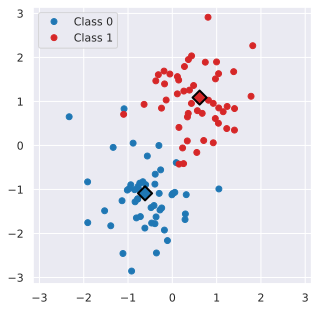
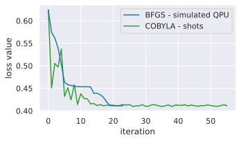
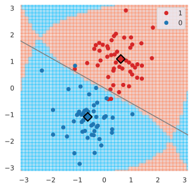
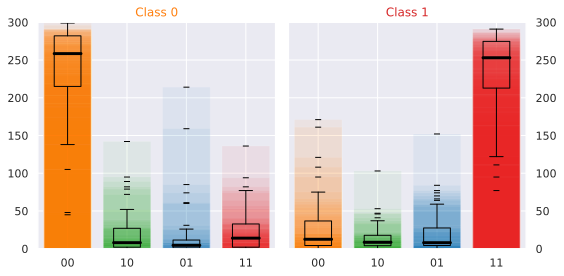

.. include:: ../substs.rst

.. _sec-classifier:

The polyadicQML |Classifier|
============================

In the previous tutorial we learned how to define a runnable parametric
*quantum circuit* using |circuitML|.
Here, we will integrate a parametric circuit in a classification model,
train its parameters and predict the classes of new samples.
All of this is easily done using a |Classifier|.

For people familiar with the popular python package `scikit-learn`_, the
syntax will be very familar, as we rely on two methods: |fit| and |pred|.
To explain each step of this tutorial (:ref:`ssec-class-init`,
:ref:`ssec-class-fit`, :ref:`ssec-class-pred`), we rely on a simple
example: the binary classification of points generated from two
gaussians on the plane, which we show in figure.

   Two clusters of binary points in two dimensions.

.. _`scikit-learn`: https://scikit-learn.org/

.. _`ssec-class-init`:

Creating a Classifier
---------------------

To define a classifier, we need two ingredients: a |circuitML| and
a list of bitstrings.
The former is the circuit we intend to use in our quantum classifier.
The list of bistrings specifies on which bitstring we want to read the classes.

.. image:: ../figures/circuit-2qb-binary.png
   :scale: 30 %
   :alt: Parametric quantum circuit on two qubits
   :align: center

Imagine we want to use the simple circuit represented in figure, to
classify the binary dataset.
Again, :math:`\omega` encodes for the input vector ``x`` and
:math:`\theta` represents the models parameters.

The first step requires to create a |circuitML|, as seen in previous tutorial.
We use the :mod:`~polyadicqml.manyq` implementation.

::

    # We define the circuit structure
    def simple_circuit(bdr, x, params):
        bdr.allin(x).cz(0,1).allin(params[:2])
        bdr.cz(0,1).allin(params[2:4])
        return bdr

    # We instantiate the circuit
    from polyadicqml.manyq import mqCircuitML

    nbqbits = 2
    nbparams = 4

    qc = mqCircuitML(make_circuit=simple_circuit,
                     nbqbits=nbqbits, nbparams=nbparams)
            
Now, we have to choose on which bitstrings to read the classes.
Since we are using two qubits, the circuit can generate four different
outputs, as the number of possible bitstrings is
:math:`2^{\text{nbqbits}}` and :math:`2^2=4`.
The bitstring choice is arbitrary and different readouts creates
different decision boundaries.
Nonetheless, we can guide our choice using heuristic arguments. 
For instance, choosing to assign ``00`` and ``01`` to class 0 and 1
respectively, would mean that our model output should always keep the
first qubit 'inactive', while using the second one to discriminate the classes.
A more thoughtful choice, in this case, could be to choose a pair of
reversed bitstrings, such as ``01,10`` or ``00,11``, so that a change in
the class can be interpreted as a flip of state on the output qubit.

We choose to go with ``00`` and ``11`` and we instantiate the classifier.
By default, the classifier uses the exact quantum-state probabilities, to
use shots-based probabilites, one should specify the ``nbshots`` keyword
argument in the constructor.

::

    from polyadicqml import Classifier

    bitstr = ['00', '11']

    model = Classifier(qc, bitstr)

.. note:: 
    The number of shots and the circuitML implementation can be changed
    at any time through the :attr:`~polyadicqml.Classifier.nbshots`
    attribute and the :meth:`~polyadicqml.Classifier.set_circuit` methods.
    This is very useful to train models on simulators and then testing
    them on real hardware.

   
.. _`ssec-class-fit`:

Training the parameters
-----------------------

Parameter training is straightforward and only requires a call to the
|fit| method, by providing the design
matrix ``X`` and the corresponding labels ``y``.

::

    model.fit(X, y)

Parameters are optimized to minimize the negative loglikelihood.

On top of that, |fit| accepts many different
optional parameters.
The first one, which can be positional, is the ``batch_size``, which
tells how many samples, picked at random, should be used at each
iteration to compute the loss.

The most important keyword argument is ``method``, a string that
specifies the numerical optimization method to be used.
For now, polyadicQML relies on the `SciPy optimization`_ module and
therefore, supports all methods provided by `scipy.optimize.minimize`_;
nevertheless, we mainly rely on ``BFGS`` and ``COBYLA``, the former being
the default method.

BFGS is a gradient based method, which we compute using finite differences.
With this approach, there is no reliable way to approximate the gradient
with a limited number of shots.
Therefore, to train a quantum model which do not use the bitstring
probabilities from the quantum state, but estimates them through shots,
we must resort to a gradient-free method, such as COBYLA.

For instance, we can choose to use shots by specifying it in the
|Classifier| constructor.
In this case, we should be aware of the optimization method.

::

    model = Classifier(qc, bitstr, nbshots=300)
    model.fit(X, y, method='COBYLA')

   Loss progress during model training.

.. _`SciPy optimization`: https://docs.scipy.org/doc/scipy/reference/optimize.html
.. _`scipy.optimize.minimize`: https://docs.scipy.org/doc/scipy/reference/generated/scipy.optimize.minimize.html

.. _`ssec-class-pred`:

Predicting on new points
------------------------

The model being trained, we can use it to predict the label of any new
point from the same space as the original dataset.
Supposing we have a matrix ``X_test``, we can predict its labels by
calling the |pred| method.

::

    labels_test = model.predict(X_test)

An equivalent, but shorter, version consists of directly calling the model.

:: 

    labels_test = model(X_test)

For instance, the figure shows the predicted label for each point in
:math:`[-\pi,\pi] \times [-\pi,\pi]`.

   Predicted label for each point in :math:`[-\pi,\pi] \times
   [-\pi,\pi]`; grey line is the bayesian decision boundary.

We can also predict the probabilities of the bitstring associated to each
class, using :meth:`~polyadicqml.Classifier.predict_proba`.

::

    probas_test = model.predict_proba(X_test)

If we want to compute the circuit output, full and raw, we can use the
|run_c| method.
It returns the counts -- or probabilities -- of all bitstrings.
For example, we can compute a realization with 300 shots over the
training set ``X``, to se how the model fits the data.

::

    # Changing nbshots from None changes from exact probabilities
    # to shots-based estimation
    model.nbshots = 300 

    # We get the counts from each bitstring
    full_output = model.run_circuit(X)

   Bitstring counts over 300 shots for the training set, from |run_c|. 

   We plot the counts for each point of the two classes, along with their
   box plot.