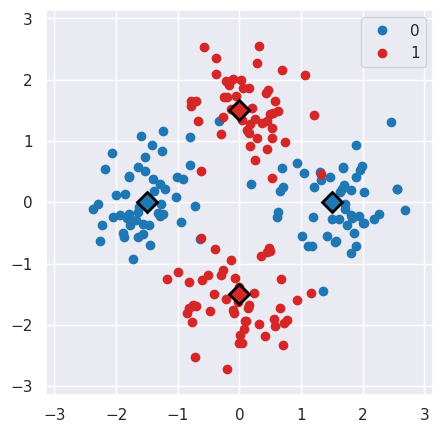
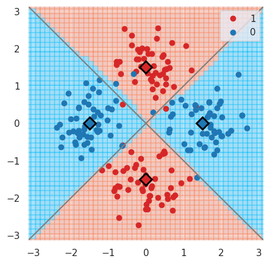
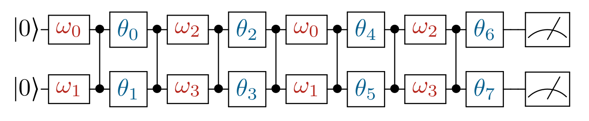

.. |circuitML| replace::
    :class:`~polyadicqml.circuitML`

.. |make_c| replace::
    :meth:`~polyadicqml.circuitML.make_circuit`

.. |qkCircuitML| replace::
    :class:`~polyadicqml.qiskit.qkCircuitML`

.. |back| replace::
    :class:`~polyadicqml.qiskit.utility.Backends`

Use cases
#########

Use case 1 : The XOR problem
============================

Our first use case is the XOR problem.
We place four points over the cartesian axes so to create a centered
square; the two points on *x*-axis are labeled as 1, while those on
*y*-axis as 0.

Dataset generation
------------------

We use numpy to generate a dataset of 200 points by sampling 50 points
from 4 gaussian distibutions centered at the said points.
The label of each sample is given by the center of its distribution.

.. code-block:: python

    import numpy as np

    n_pc = 50 # Number of points per cluster

    # Create a matrix of vertices of the centered square
    X = np.asarray(n_pc * [[1.5, 0.]] +
                   n_pc * [[-1.5, 0.]] + 
                   n_pc * [[0., -1.5]] + 
                   n_pc * [[0., 1.5]]
    )
    # Add gaussian noise
    X += .5 * np.random.randn(*X.shape)

    # Create target vecor
    y = np.concatenate((np.zeros(2*n_pc), np.ones(2*n_pc)))

This generates the following dataset, where the circles represent the
samples and the squares the distribution centers.

Circuit definition
------------------

Now, we define the circuit structure using a `circuitBulder`.
This function has to respect a precise signature: |make_c| (``bdr``,
``x``, ``params``). 

.. code-block:: python

    def make_circuit(bdr, x, params):
        """Generate the circuit corresponding to input `x` and `params`.

        Parameters
        ----------
        bdr : circuitBuilder
            A circuit builder.
        x : vector-like
            Input sample
        params : vector-like
            Parameter vector.

        Returns
        -------
        circuitBuilder
            Instructed builder
        """

        bdr.allin(x[[0,1]])

        bdr.cz(0, 1).allin(params[[0,1]])

        bdr.cz(0, 1).allin(params[[2,3]])

        return bdr

Model training 
---------------

Finally, we can create and train the classifier. 
We instantiate the |circuitML| subclass that we prefer, in this case the one using the fast *manyq* simualtor, specifying the number of qubits and of parameters.

.. code-block:: python

    from polyadicqml.manyq import mqCircuitML

    nbqbits = 2
    nbparams = 6

    qc = mqCircuitML(make_circuit=make_circuit,
                    nbqbits=nbqbits, nbparams=nbparams)

Then, we create and train the quantum classifer, specifying on which
bitstrings we want to read the predicted classes.

.. code-block:: python

    from polyadicqml import Classifier

    bitstr = ['00', '01']

    model = Classifier(qc, bitstr)
    model.fit(X, y)

Predict on new data
-------------------

We can use a model to predict on some new datapoints ``X_test`` that it
never saw before.
To obtain the bitstring probabilities, we can just call the model:

.. code-block:: python

    pred_prob = model.predict_proba(X_test)

Then, we can retrieve the label of each point as the argmax of the
corresponding probabilities.
Otherwise, we can combine the two operations by using the shorthand:

.. code-block:: python

    y_pred = model(X_test)

For instance, going back to our XOR problem, we can predict the label of
each point on a grid that covers :math:`(-\pi,\pi)\times(-\pi,\pi)`, to
assess the model accuracy.
Using some list comprehension, it would look like this:

.. code-block:: python

    t = np.linspace(-np.pi,np.pi, num = 50)
    X_test = np.array([[t1, t2] for t1 in t for t2 in t])

    y_pred = model(X_test)

We can now plot the predictions and see that the model is very close to
the bayesian prediction (whose decision boundaries are shown as grey
lines), which is the best possible.

Use case 2: The Iris Flower dataset
===================================

For the second use case, we perform ternary classification on the Iris Flower dataset.
In this case, we will train the model using a simulator and then test it
on a real quantum computer, using IBMQ access.

Data preparation
----------------

.. _scikit-learn: https://scikit-learn.org/

We load the dataset from scikit-learn_ and we split it in a train and a
test set, representing respectively 60% and 40% of the samples.

.. code-block:: python

    from sklearn import datasets
    from sklearn.model_selection import train_test_split

    iris = datasets.load_iris()
    data = iris.data
    target = iris.target

    # Train-test split
    input_train, input_test, target_train, target_test =\
        train_test_split(data, target, test_size=.4, train_size=.6, stratify=target)

Then, we center it and rescale it so that it has zero mean and all the
feature values fall between :math:`(-0.95\pi,0.95\pi)`. (Actually, with
our scaling, last interval should cover 99% of a gaussian with the same
mean and std; it covers all points on almost all splits.)

.. code-block:: python

    import numpy as np

    # NORMALIZATION
    mean = input_train.mean(axis=0)
    std = input_train.std(axis=0)

    input_train = (input_train - mean) / std / 3 * 0.95 * np.pi
    input_test = (input_test - mean) / std / 3 * 0.95 * np.pi

Circuit definition
------------------

Now, we define a circuit on two qubits, again using the |make_c| syntax.
Thanks to the functional nature, we can use other fuctions to group
repeated instructions.

.. code-block:: python

    def block(bdr, x, p):
        bdr.allin(x[[0,1]])
        bdr.cz(0,1).allin(p[[0,1]])

        bdr.cz(0,1).allin(x[[2,3]])
        bdr.cz(0,1).allin(p[[2,3]])

    def irisCircuit(bdr, x, params):
        # The fist block uses all `x`, but
        # only the first 4 elements of `params`
        block(bdr, x, params[:4])

        # Add one entanglement not to have two adjacent input
        bdr.cz(0,1)
        
        # The block repeats with the other parameters
        block(bdr, x, params[4:])

        return bdr

Which corresponds to the following circuit:

Model training
--------------

As in the previous use case, we need a |circuitML| and a classifier, which we train with the corresponding dataset.

.. code-block:: python

    from polyadicqml.manyq import mqCircuitML
    from polyadicqml import Classifier

    nbqbits = 2
    nbparams = 8

    qc = mqCircuitML(make_circuit=irisCircuit,
                    nbqbits=nbqbits, nbparams=nbparams)

    bitstr = ['00', '01', '10']

    model = Classifier(qc, bitstr).fit(input_train, target_train)

We can print the training scores.

.. code-block:: python

    >>> from polyadicqml.utility import print_results
    >>> pred_train = model(input_train)
    >>> print_results(target_train, pred_train, name="train")

    Confusion matrix on train:
    [[30  0  0]
    [ 0 30  0]
    [ 0  4 26]]
    Accuracy : 0.9556

Model Testing
-------------

.. _`IBMQ account`: https://qiskit.org/ibmqaccount/

Once the model is trained, we can test it.
Furthermore, we can keep the trained parameters and change the circuit
backend, as long as the |make_c| function is the same.
So, if we have an `IBMQ account`_ configured and access to a quantum
backend (in this case *ibmq-burlington*), we can run the test on an actual hardware.

We use the |back| utility class, along with the |qkCircuitML|, which
implements |circuitML| for qiksit use.
**NOTE** that we must provide a number of shots, as the backend is not a
simulator; the job size is inferred if left empty, but we chose to set it at 40.

.. code-block:: python

    from polyadicqml.qiskit.utility import Backends
    from polyadicqml.qiskit import qkCircuitML

    backend = Backends("ibmq_burlington", hub="ibm-q")

    qc = qkCircuitML(backend=backend,
                    make_circuit=irisCircuit,
                    nbqbits=nbqbits, nbparams=nbparams)

    model.set_circuit(qc)
    model.nbshots = 300
    model.job_size = 40

    pred_test = model(input_test)

Finally, we can print the test scores:

.. code-block:: python

    >>> from polyadicqml.utility import print_results
    >>> pred_test = model(input_test)
    >>> print_results(target_test, pred_test, name="test")

    Confusion matrix on test:
    [[20  0  0]
    [ 0 20  0]
    [ 0  0 20]]
    Accuracy : 1.0

Source code
===========

The git page contains the source code that produced the results and the
figures in this use cases.
Note that the second experiment being run on a physical quantum computer,
the test output is random, so it could slightly differ form the presented
one -- run on ibmq_burlington the 23rd June 2020. 

From the root directory, the use cases can be run by command line as:

- Use case 1 : ``python3 exaples/example-XOR.py``
- Use case 2 : ``python3 exaples/example-iris.py``